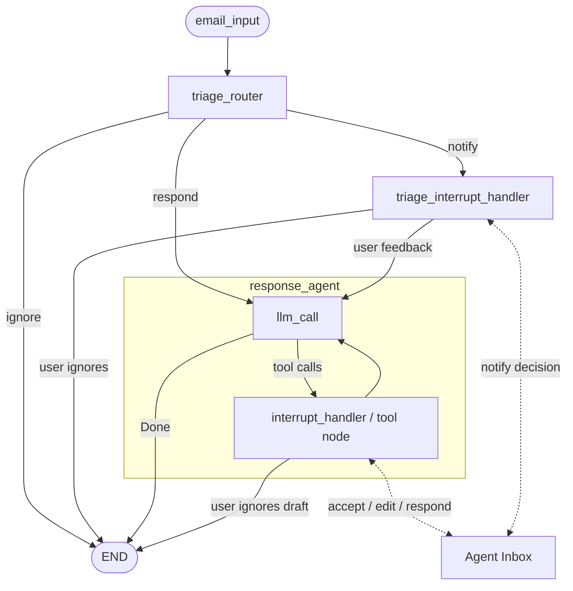

# LangGraph Email Agent

An email-inbox agent built on LangGraph: it triages incoming mail, drafts replies and
calendar actions with tools, pauses for human approval before anything consequential is
sent, and folds the human's corrections back into long-term preference memory.

The repository contains a ladder of five deployable graphs, from a minimal
triage-plus-agent pipeline up to a Gmail-connected assistant with human-in-the-loop
(HITL) review and store-backed memory, plus the ingestion and cron machinery to run the
Gmail variant against a real mailbox. It builds on the open-source
[agents-from-scratch](https://github.com/langchain-ai/agents-from-scratch) codebase.

## Architecture at a glance

- **Orchestration pattern**: a sequential two-stage pipeline — an LLM **triage router**
  (structured output, `Command`-based routing) followed by a **single-agent tool-calling
  loop**. The advanced graphs insert **interrupt gates** at the tool boundary: every
  consequential tool call (`write_email`, `schedule_meeting`, `Question`) is paused via
  LangGraph `interrupt()` and surfaced to a human in
  [Agent Inbox](https://github.com/langchain-ai/agent-inbox) for accept / edit /
  respond / ignore. Nothing runs in parallel inside a graph; side effects are
  deliberately serialized. See [docs/ARCHITECTURE.md](docs/ARCHITECTURE.md).
- **Models**: OpenAI `gpt-4.1` (temperature 0) for triage, response generation, and
  memory updates, via `langchain.chat_models.init_chat_model`; `gpt-4o` as the
  LLM judge in the test suite.
- **Frameworks**: LangGraph + LangChain; served by `langgraph dev` locally or LangGraph
  Platform hosted; LangSmith for tracing and evaluation.
- **Memory / session state**: conversation state is LangGraph `MessagesState` with a
  checkpointer (supplied by the platform, `MemorySaver` in tests). Long-term memory is a
  LangGraph `BaseStore` holding three preference profiles —
  `("email_assistant", "triage_preferences" | "response_preferences" | "cal_preferences")`
  — each rewritten by a structured-output LLM call whenever the human edits, redirects,
  or ignores a draft.
- **Retrieval**: none. There is no vector store; context is assembled per call from the
  email itself, prompt templates, and the live memory profiles.



## The graph ladder

All graphs are registered in [`langgraph.json`](langgraph.json):

| Graph | Source | Adds |
|---|---|---|
| `langgraph101` | `src/email_assistant/langgraph_101.py` | Minimal LangGraph example |
| `email_assistant` | `src/email_assistant/email_assistant.py` | Triage router + tool-calling agent (mock tools) |
| `email_assistant_hitl` | `src/email_assistant/email_assistant_hitl.py` | Interrupt gates on consequential tools |
| `email_assistant_hitl_memory` | `src/email_assistant/email_assistant_hitl_memory.py` | Store-backed preference memory updated from human feedback |
| `email_assistant_hitl_memory_gmail` | `src/email_assistant/email_assistant_hitl_memory_gmail.py` | Real Gmail/Calendar tools + mark-as-read terminal node |
| `cron` | `src/email_assistant/cron.py` | Ingestion wrapper graph for scheduled runs on LangGraph Platform |

## Quickstart

Requires Python 3.11+.

```bash
git clone https://github.com/git-bonda108/langgraph-email-agent.git
cd langgraph-email-agent

# Install with uv (or: pip install -e .)
pip install uv
uv sync --extra dev
source .venv/bin/activate

# Configure keys
cp .env.example .env   # then edit .env with your keys

# Serve all graphs locally
langgraph dev
```

`langgraph dev` starts the LangGraph API on `http://127.0.0.1:2024` and prints links to
the API, the Studio UI, and the API docs. From Studio you can invoke any graph; for the
HITL graphs, submit an `email_input` and handle the interrupt in
[Agent Inbox](https://dev.agentinbox.ai/) (Deployment URL `http://127.0.0.1:2024`,
Graph ID e.g. `email_assistant_hitl_memory`).

An `email_input` looks like:

```json
{
  "author": "Alice Smith <alice.smith@company.com>",
  "to": "you@example.com",
  "subject": "Quick question about API documentation",
  "email_thread": "Hi, ..."
}
```

Run the automated tests (requires `OPENAI_API_KEY` and `LANGSMITH_API_KEY`; results are
logged to LangSmith):

```bash
python tests/run_all_tests.py
```

## Configuration

All configuration is via environment variables loaded from `.env`
(see [`.env.example`](.env.example)):

| Variable | What it is | Where to get it |
|---|---|---|
| `OPENAI_API_KEY` | Key for `gpt-4.1` (graphs) and `gpt-4o` (test judge) | platform.openai.com |
| `LANGSMITH_API_KEY` | Tracing and evaluation logging | smith.langchain.com → Settings → API Keys |
| `LANGSMITH_TRACING` | Enables tracing when `true` | set to `true` |
| `LANGSMITH_PROJECT` | Project name traces are filed under | any name you choose |
| `GMAIL_TOKEN` | Gmail variant only: full JSON of the OAuth token (alternative to `.secrets/token.json`) | produced by `setup_gmail.py`; see [Gmail setup](src/email_assistant/tools/gmail/README.md) |
| `GMAIL_SECRET` | Gmail variant only: full JSON of the OAuth client secret (alternative to `.secrets/secrets.json`) | Google Cloud Console OAuth credentials |

Never commit `.env` or the `.secrets/` directory; both are gitignored.

## Repository map

```
langgraph-email-agent/
├── langgraph.json               # Graph registry for langgraph dev / Platform
├── src/email_assistant/
│   ├── email_assistant*.py      # The four assistant graphs (see ladder above)
│   ├── cron.py                  # Ingestion graph for scheduled runs
│   ├── prompts.py               # Triage/agent/memory-update prompt templates
│   ├── schemas.py               # State, RouterSchema, UserPreferences
│   ├── utils.py                 # Email parsing and formatting helpers
│   ├── tools/
│   │   ├── base.py              # Tool registry (get_tools)
│   │   ├── default/             # Mock email + calendar tools
│   │   └── gmail/               # Gmail/Calendar API tools, ingestion, cron setup
│   └── eval/                    # Ground-truth dataset + triage experiment
├── notebooks/                   # Guided notebooks: 101, agent, evaluation, HITL, memory
├── tests/                       # pytest suite (LangSmith-integrated)
└── docs/                        # ARCHITECTURE, EVALUATION, HARDENING
```

## Documentation

- [docs/ARCHITECTURE.md](docs/ARCHITECTURE.md) — component map, data flow,
  orchestration analysis, state and context engineering, design trade-offs
- [docs/EVALUATION.md](docs/EVALUATION.md) — what is tested today, how to run it, and
  the proposed evaluation harness
- [docs/HARDENING.md](docs/HARDENING.md) — current security posture and a staged
  path to production
- [src/email_assistant/tools/gmail/README.md](src/email_assistant/tools/gmail/README.md)
  — Gmail/Calendar credentials, ingestion, hosted deployment, and cron setup

## Operations dashboard

`ops-dashboard/` is the operational surface around the agent: a Flask monitoring dashboard, a Gmail-to-LangSmith ingestion runner, LangSmith integration tests, and a Vercel deployment configuration. See `ops-dashboard/README.md`.
