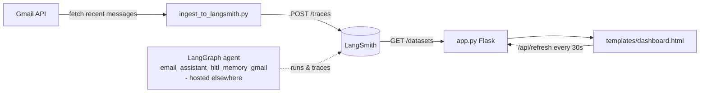

# Email Agent Ops Dashboard — Observability and Gmail Ingestion

A Flask dashboard and Gmail ingestion companion for an email-assistant agent graph hosted on LangSmith.

This repository does not contain the agent itself. It is the operational surface around one:
a read-only web dashboard that polls the LangSmith API and renders processing statistics for
the graph `email_assistant_hitl_memory_gmail` (a human-in-the-loop Gmail assistant deployed
separately), plus a script that pulls recent messages from a Gmail inbox and posts them to
LangSmith as traces so the dashboard has data to show. It is intended for the operator of that
agent who wants a single page answering "what has my inbox agent been doing?"

## Architecture at a glance

- **Orchestration pattern (in this repo):** sequential pipeline — no agent loop, no LLM calls,
  and no parallelism exist in this codebase. `ingest_to_langsmith.py` fetches Gmail messages
  and posts them one at a time to LangSmith; `app.py` synchronously polls LangSmith on each
  page load and renders the result. The agentic behavior (triage, HITL interrupts, memory)
  belongs to the externally hosted LangGraph graph that this repo only observes by its ID.
- **Frameworks:** Flask 2.3.3 (dashboard), `requests` (LangSmith REST calls),
  `google-api-python-client` + `google-auth` (Gmail, ingestion script only). No model or LLM
  SDK is imported anywhere in this repo.
- **Memory / session state:** none. The dashboard is stateless; every request re-fetches from
  LangSmith. There is no database, cache, or server-side session.
- **Retrieval:** plain REST polling of the LangSmith `/datasets` endpoint, filtered by whether
  the dataset name contains the configured `GRAPH_ID`.



## Quickstart

```bash
git clone https://github.com/git-bonda108/autonomous-email-agent-langgraph.git
cd email-agent-ops-dashboard
pip install -r requirements.txt

cat > .env <<'EOF'
LANGSMITH_API_KEY=your-langsmith-api-key
GRAPH_ID=email_assistant_hitl_memory_gmail
LANGSMITH_ENDPOINT=https://api.smith.langchain.com
EOF

python app.py
```

Expected output:

```
 * Serving Flask app 'app'
 * Debug mode: on
 * Running on http://127.0.0.1:5000
```

Open http://127.0.0.1:5000. With a valid API key you get a green "Connected to LangSmith"
banner; with no matching dataset yet, the statistics show zeros and the page explains the next
steps. Without an API key the page renders with an error banner instead of crashing.

To ingest real emails (optional, requires Google OAuth setup):

```bash
mkdir gmail_credentials
# place credentials-gmail.json (OAuth client) and token.json (authorized user token) inside
pip install google-api-python-client google-auth google-auth-oauthlib  # not in requirements.txt
python ingest_to_langsmith.py
```

Note: the Gmail client libraries are imported by `ingest_to_langsmith.py` but are not listed in
`requirements.txt`, which covers only the dashboard.

## Configuration

| Variable | Required | Default | Purpose / where to get it |
|---|---|---|---|
| `LANGSMITH_API_KEY` | yes | none | LangSmith API key, created under Settings > API Keys at smith.langchain.com. Sent as the `x-api-key` header. |
| `LANGSMITH_ENDPOINT` | no | `https://api.smith.langchain.com` | LangSmith API base URL. |
| `GRAPH_ID` | no | `email_assistant_hitl_memory_gmail` in `app.py`; `autonomous-email-inbox` in `ingest_to_langsmith.py` | Name of the LangSmith project/graph to match. Note the two files ship different defaults — set it explicitly so both agree. |

File-based credentials (ingestion script only, never committed):

| File | Purpose |
|---|---|
| `gmail_credentials/credentials-gmail.json` | Google OAuth client configuration |
| `gmail_credentials/token.json` | Authorized user token for the Gmail account |

## Deployment

The repo is set up for Vercel (`vercel.json`, `@vercel/python`, Python 3.11, build via
`vercel-build.sh`). See [DEPLOYMENT.md](DEPLOYMENT.md) for the step-by-step guide. No live
demo URL is maintained in this repository.

## Documentation

- [docs/ARCHITECTURE.md](docs/ARCHITECTURE.md) — component map, data flow, design trade-offs
- [docs/EVALUATION.md](docs/EVALUATION.md) — what testing exists, what is proposed
- [docs/HARDENING.md](docs/HARDENING.md) — security posture and the path to production
